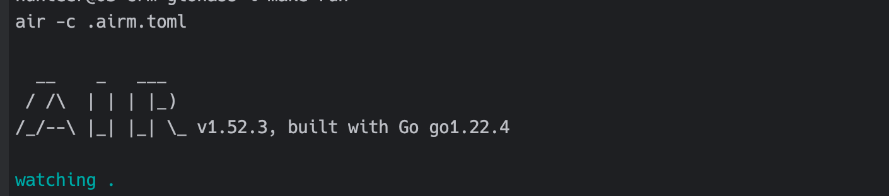

# Comecord CRM
Version: 0.1.x

REST API service for managing clients, vehicles, monitoring and transport accounting. 

Works with the GLONASS system https://hosting.glonasssoft.ru

## How start 
After you have downloaded the repository, you will need to complete the following steps to start the project.

**Step 1.**

Get repository 
```bash
go mod download
```
**Step 2.** 

Need install docker MongoDB and Redis
```bash
docker-compose up -d
```
or specify the settings in `config/config-development.yml` with your data


**Step 3.**

Download package AIR for GO https://github.com/air-verse/air

```bash
go install github.com/air-verse/air@latest
```

**Star with Air in MacOS / Linux**
```bash
 air -c .airm.toml
```



**Star with Air in Windows**
```bash
 air
```

**Step 4.**

Documentation in OpenAPI can be viewed at this link after launching the project local
http://localhost:5100/swagger/index.html

## Swagger Init
<details>
<summary> Install and Update Swagger data</summary>

```markdown
1. go install github.com/swaggo/swag/cmd/swag@v1.16.3
2. go get github.com/swaggo/gin-swagger
3. go get github.com/swaggo/swag
4. go get github.com/swaggo/files
5. swag init -g cmd/main.go
6. swag init -g cmd/main.go --parseDependency --parseInternal
```
</details>

This project is licensed under the Apache License 2.0. See the LICENSE file for details.
